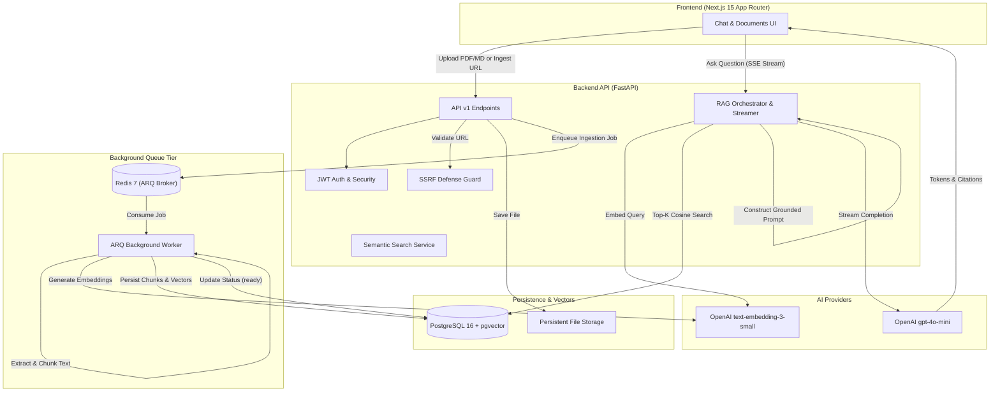

# AI Knowledge Assistant

> Production-grade full-stack Retrieval-Augmented Generation (RAG) platform built with Next.js 15, FastAPI, PostgreSQL (pgvector), Redis ARQ workers, and OpenAI.

AI Knowledge Assistant enables users to build isolated private knowledge bases from PDF files, Markdown documents, and web pages, and interact with them via low-latency streaming chat with grounded inline source citations.

---

## 🏗️ Architecture



---

## ⚡ Key Features

- **Multi-Tenant User Isolation**: Strict SQL-level partitioning ensures documents, chunks, embeddings, and chat histories are visible only to the authenticated owner.
- **Asynchronous Document Processing**: Ingestion happens off the main request thread via a dedicated Redis ARQ background worker with automatic retry backoff.
- **Multi-Source Ingestion**:
  - **PDF Documents**: Clean text extraction with structured heading detection.
  - **Markdown Documents**: Structural heading-aware parsing.
  - **Web Pages**: Single-page URL scraping with Trafilatura and BeautifulSoup extraction.
- **SSRF Defense in Depth**: Strict URL validation blocking private IP ranges (`10.0.0.0/8`, `172.16.0.0/12`, `192.168.0.0/16`, `127.0.0.0/8`, `169.254.169.254`), cloud metadata endpoints, internal Docker DNS hostnames, and unsafe redirect chains.
- **Streaming Conversational RAG**: Server-Sent Events (SSE) token-by-token streaming with grounded prompt boundaries and conversation history persistence.
- **Interactive Citations**: Inline citation markers `[1]` that map to exact source documents, page numbers, section headings, and text previews.
- **Automated RAG Evaluation**: Built-in deterministic benchmark suite measuring retrieval accuracy, Mean Reciprocal Rank (MRR), groundedness, and citation fidelity.
- **Production Observability**: Request correlation IDs (`X-Request-ID`), per-request execution timing (`X-Process-Time`), and privacy-safe structured logging.

---

## 💻 Tech Stack

| Component | Technology | Description |
| :--- | :--- | :--- |
| **Frontend** | Next.js 15, React 19, TypeScript, Tailwind CSS | Standalone App Router interface with responsive sidebar and citation popovers |
| **Backend API** | Python 3.12, FastAPI, Pydantic v2 | Asynchronous REST API with RFC 7807 error handling |
| **Vector Database** | PostgreSQL 16 + `pgvector` | Relational metadata with HNSW vector indexing |
| **Queue / Worker** | Redis 7 + `arq` | Asynchronous document processing worker with 3 automatic retries |
| **AI Providers** | OpenAI (`text-embedding-3-small` & `gpt-4o-mini`) | Embeddings & LLM generation (with mock fallback for CI/tests) |
| **Migrations** | Alembic + SQLAlchemy 2.0 (Async) | Version-controlled database schema migrations |
| **Containerization**| Docker, Docker Compose (Multi-stage builds) | Production and development orchestration |

---

## 🔍 How RAG Works

### 1. Document Ingestion Pipeline
```text
Upload (PDF/MD/URL) ──> FastAPI (Validate) ──> Redis Queue ──> Worker ──> Text Extraction ──> Normalization ──> Recursive Chunking (800 tokens, 100 overlap) ──> Embedding (1536-dim) ──> pgvector
```

### 2. Retrieval & Generation Pipeline
```text
User Question ──> Embed Query ──> pgvector Cosine Search (<=>) ──> Top-K Chunks ──> Context Assembly ([SOURCE_N]) ──> Grounded System Prompt ──> LLM Streaming ──> Tokens + Citations
```

---

## 📊 RAG Evaluation & Baseline Metrics

The project includes an automated evaluation framework (`apps/api/src/evaluation/`) testing 25 benchmark cases across 7 query categories (Factoid, Synthesis, Paraphrased, Document-filtered, Unanswerable, Multi-document, and Follow-up).

### Baseline Evaluation Results (Deterministic 25-Case Benchmark)

| Metric | Result | Target / Standard | Description |
| :--- | :--- | :--- | :--- |
| **Hit@1** | **65.00%** | > 60% | Correct chunk ranked #1 |
| **Hit@3** | **80.00%** | > 75% | Correct chunk within top 3 |
| **Hit@5** | **85.00%** | > 80% | Correct chunk within top 5 |
| **MRR** (Mean Reciprocal Rank) | **0.7292** | > 0.70 | Average reciprocal rank of first relevant chunk |
| **Groundedness Score** | **3.84 / 4.00** | > 3.50 | LLM answers fully grounded in provided context |
| **Valid Citations Rate** | **100.0%** | 100% | Citations mapping to valid retrieved sources |
| **Hallucinated Citations** | **0** | 0 | Citations referencing non-existent sources |

---

## 🚀 Quick Start

### Prerequisites
- [Docker](https://docs.docker.com/get-docker/) (v24+)
- [Docker Compose](https://docs.docker.com/compose/) (v2+)
- OpenAI API Key (optional for development; mock mode is supported)

### 1. Clone & Configure Environment
```bash
git clone https://github.com/your-username/ai-knowledge-assistant.git
cd ai-knowledge-assistant
cp .env.example .env
```
*(Optionally add your `OPENAI_API_KEY` in `.env`. If left empty or set to `mock`, the system will use local deterministic mock providers).*

### 2. Start the Stack
```bash
docker compose up --build
```

### 3. Access Services
- **Web Dashboard**: [http://localhost:3000](http://localhost:3000)
- **FastAPI Backend**: [http://localhost:8000](http://localhost:8000)
- **Swagger Documentation**: [http://localhost:8000/docs](http://localhost:8000/docs)
- **Health Diagnostics**: [http://localhost:8000/api/v1/health](http://localhost:8000/api/v1/health)

---

## 🧪 Running Tests & Evaluation

### Backend Unit & Integration Tests (105 Tests)
```bash
docker compose exec backend pytest -v
```

### Frontend Linting & Type Checking
```bash
docker compose exec frontend npm run lint
docker compose exec frontend npx tsc --noEmit
```

### Run RAG Benchmark Evaluation
```bash
# Retrieval evaluation
docker compose exec backend python -m apps.api.src.evaluation.cli --retrieval-only

# Full end-to-end evaluation
docker compose exec backend python -m apps.api.src.evaluation.cli --run
```

---

## 🔒 Security & Production Hardening

- **JWT Authentication**: Stored in `HttpOnly`, `SameSite=Lax` cookies with strict expiration and configurable `Secure` flags for HTTPS.
- **Password Security**: Salted hashing with `bcrypt`.
- **SSRF Defense Guard**: Validates public IP ranges on initial URL ingestion and intercepts redirect chains during fetch.
- **Upload Restrictions**: MIME-type verification, magic-byte inspection, file size ceilings (20MB), and sanitized storage paths.
- **CORS Allowlist**: Configurable allowed origins; prevents wildcard `*` with credentials.
- **Security Headers**: Standard defense-in-depth headers (`X-Content-Type-Options`, `X-Frame-Options`, `Referrer-Policy`).

---

## 🚢 Production Deployment

For production deployments, utilize `docker-compose.prod.yml` or containerized platforms (AWS ECS, Fly.io, Railway, Kubernetes):

```bash
docker compose -f docker-compose.prod.yml up -d --build
```

### Key Production Requirements:
1. **Persistent Object Storage**: Mount persistent network storage volumes or swap `LocalFileSystemStorage` for AWS S3 / Cloudflare R2.
2. **Managed Database**: Use managed PostgreSQL 16 with the `pgvector` extension enabled and automated daily snapshots.
3. **HTTPS & Domain**: Place the frontend and backend behind an SSL reverse proxy (e.g., Cloudflare, Nginx, or AWS ALB).

---

## ⚠️ Known Limitations

- **JavaScript Rendering**: Website ingestion currently fetches static HTML (via `httpx` + `trafilatura`); complex client-rendered SPA pages are not executed.
- **Single-Page Ingestion**: Web ingestion parses single URLs rather than recursive web crawls.
- **Dense-Only Retrieval**: Retrieval currently uses dense vector cosine similarity; hybrid sparse-dense search (BM25 + pgvector) and cross-encoder rerankers are planned for future major releases.
- **Non-OCR PDF**: Scanned image-only PDFs require machine-readable text layers.

---

## 📄 License

This project is licensed under the [MIT License](LICENSE).
